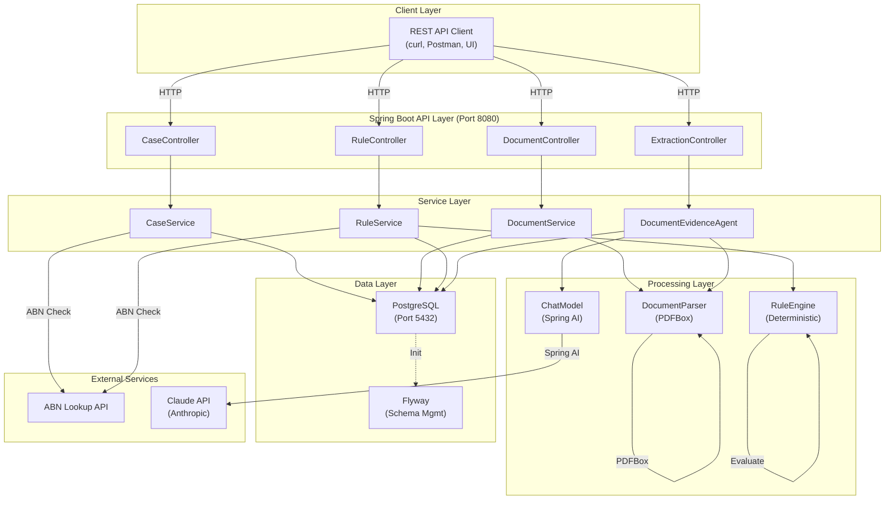
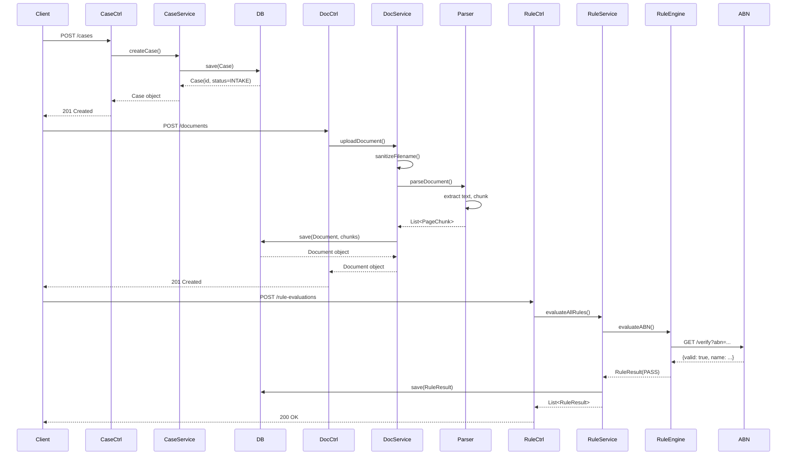

# Architecture

## System Diagram



## Component Architecture

### 1. **Controller Layer (REST Endpoints)**

| Controller | Responsibility |
|------------|-----------------|
| `CaseController` | Create/retrieve/update cases |
| `DocumentController` | Upload/retrieve documents |
| `RuleController` | Trigger rule evaluation |
| `ExtractionController` | Trigger evidence extraction |

### 2. **Service Layer (Business Logic)**

| Service | Responsibility |
|---------|-----------------|
| `CaseService` | Case workflow, state transitions |
| `DocumentService` | Document persistence, file handling |
| `RuleService` | Rule evaluation logic |
| `DocumentEvidenceAgent` | LLM-based evidence extraction |
| `SupplierVerificationService` | ABN lookup, name matching |

### 3. **Processing Layer (Core Algorithms)**

| Component | Technology | Purpose |
|-----------|-----------|---------|
| `DocumentParser` | Apache PDFBox 3.0 | Extract text, chunk into 500-char segments |
| `RuleEngine` | Java enums | Deterministic business rule evaluation |
| `ChatModel` | Spring AI 2.0.1 | LLM calls to Claude API |

### 4. **Data Layer (Persistence)**

| Component | Technology | Purpose |
|-----------|-----------|---------|
| `CaseRepository` | Spring Data JPA | Case CRUD + queries |
| `DocumentRepository` | Spring Data JPA | Document persistence |
| `RuleResultRepository` | Spring Data JPA | Rule evaluation results |
| `PostgreSQL` | Database | Primary data store |
| `Flyway` | Migration tool | Schema versioning (V1-V5) |
| `H2 (Test)` | In-memory DB | Fast isolated tests |

### 5. **External Services**

| Service | Purpose | Type |
|---------|---------|------|
| ABN Lookup API | Verify Australian business identity | HTTP REST |
| Claude API | LLM-based fact extraction | HTTP REST |

---

## Data Flow Example: Case Submission → Rule Evaluation



---

## Technology Stack

### Backend
- **Framework:** Spring Boot 3.3.0
- **Language:** Java 20
- **Build:** Maven 3.9+
- **Testing:** JUnit 5, Mockito, Testcontainers

### Data
- **Primary DB:** PostgreSQL 15
- **Test DB:** H2 in-memory
- **Migrations:** Flyway 9.x
- **ORM:** Hibernate JPA

### AI/ML
- **LLM Framework:** Spring AI 2.0.1
- **LLM Provider:** Anthropic Claude API
- **Model:** Claude 3.5 Sonnet
- **PDF Parsing:** Apache PDFBox 3.0

### Infrastructure
- **Containerization:** Docker/Docker Compose
- **Documentation:** Docusaurus 3.0
- **Node.js:** 16+ (documentation only)

---

## Key Design Decisions

### 1. **Deterministic Rules First, LLM Advisory**
- Rules engine evaluates business logic (ABN valid, sanctions, thresholds)
- Claude provides evidence extraction and risk insights
- **Why:** Compliance requires deterministic decision trails; LLM handles ambiguous text

### 2. **Document Chunking (500 chars + 50 overlap)**
- PDFs extracted as 500-character chunks with 50-character overlap
- Chunks include page numbers and position info
- **Why:** Balances context for LLM while maintaining granularity for citing sources

### 3. **State Machine for Cases**
- Cases follow strict state transitions: INTAKE → DOCUMENT_UPLOADED → RULES_EVALUATED → ...
- Invalid transitions are rejected (no backwards steps)
- **Why:** Ensures workflow integrity, prevents data inconsistency

### 4. **Immutable Rule Results**
- Rule evaluation results are never updated, only created
- Historical changes tracked via timestamps and versioning
- **Why:** Audit trail requirement; compliance needs permanent evidence

### 5. **Case Ownership Enforcement**
- Document access/deletion verified against case ownership (composite query)
- Prevents cross-case data leakage
- **Why:** Multi-tenant isolation, security

### 6. **Filename Sanitization & Streaming**
- Uploaded filenames sanitized (remove "/" and "\\")
- Files streamed to disk (not loaded into memory)
- **Why:** Path traversal prevention, handles large files efficiently

---

## Security Considerations

| Concern | Mitigation |
|---------|-----------|
| **Path Traversal** | Filename sanitization (remove "/" and "\\") |
| **File Upload DoS** | File size limits, stream processing |
| **SQL Injection** | JPA parameterized queries, ORM protection |
| **Unauthorized Access** | Case ownership enforcement, composite queries |
| **API Key Exposure** | Environment variables, never hardcoded in production |
| **Data Persistence** | Encrypted passwords (bcrypt), sensitive fields masked |

---

## Deployment Architecture

```
┌─────────────────────────────────────────────┐
│         Docker Container                     │
│  ┌───────────────────────────────────────┐  │
│  │  Spring Boot Application               │  │
│  │  (Port 8080)                          │  │
│  │  ├─ CaseService                       │  │
│  │  ├─ DocumentService                   │  │
│  │  ├─ RuleService                       │  │
│  │  └─ DocumentEvidenceAgent              │  │
│  └───────────────────────────────────────┘  │
└─────────────────────────────────────────────┘
           ↓                           ↓
    ┌──────────────┐        ┌──────────────────┐
    │ PostgreSQL   │        │ External APIs    │
    │ Container    │        │                  │
    │ (Port 5432)  │        │ - ABN Lookup     │
    └──────────────┘        │ - Claude API     │
                            └──────────────────┘
```

---

## Scalability Considerations

### Current (Single Instance)
- Single Spring Boot instance
- Single PostgreSQL instance
- Synchronous request handling

### Future (Horizontal Scale)
- Load balancer → multiple app instances
- PostgreSQL read replicas
- Message queue (RabbitMQ) for async rule evaluation
- Redis for caching ABN lookups

### Current Bottlenecks
1. Claude API rate limits (requests/min)
2. Single database connection pool
3. Synchronous PDF parsing (large files block requests)

---

## Next Steps

- **Understand data models:** See [Models](./models.md)
- **Learn rule evaluation:** Read [Rules Evaluation](./deep-dives/rules-evaluation.md)
- **Explore PDF parsing:** Check [PDF Parsing](./deep-dives/pdf-parsing.md)
- **Review phases:** See [Phases](./phases.md)
