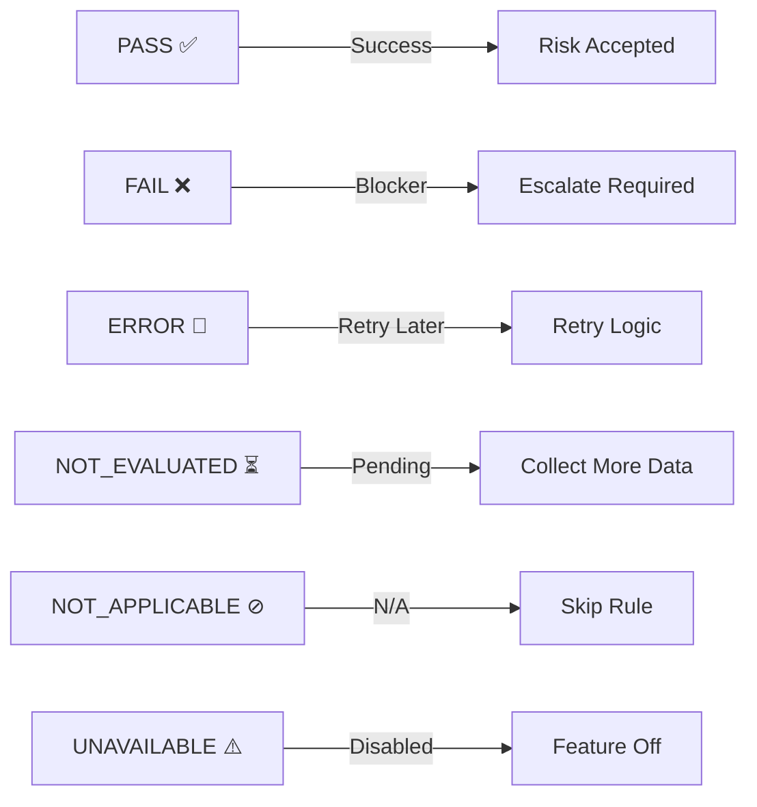
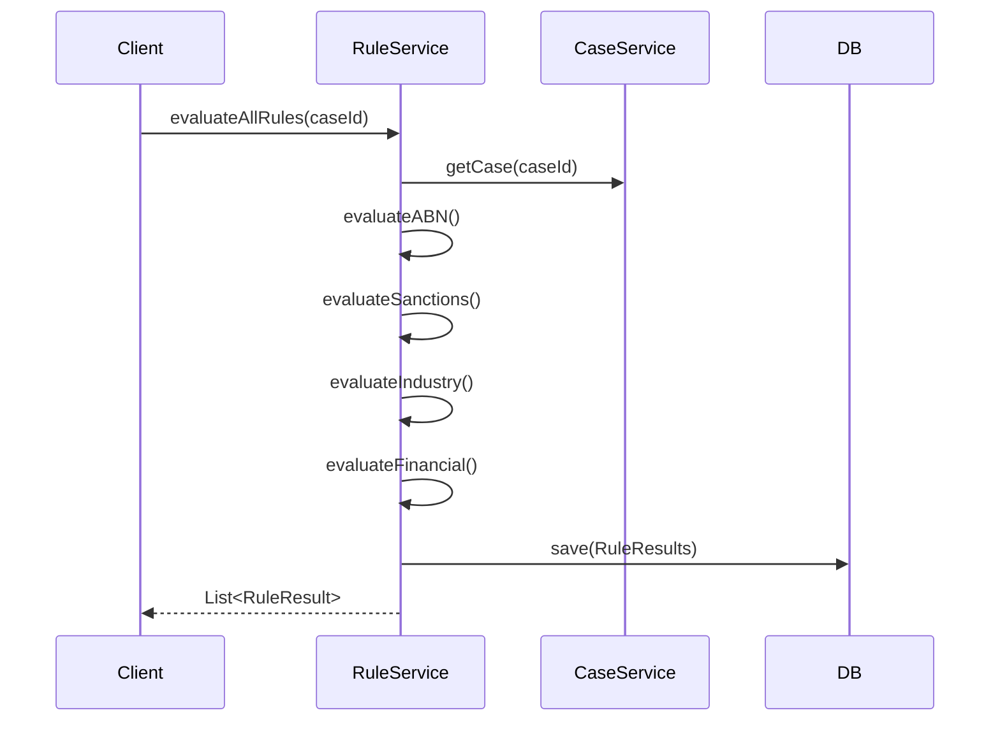

# Rules Evaluation Engine

How business rules are evaluated deterministically.

## Rule Types & Logic

```
┌─────────────────────────────────────────────────────────┐
│                    RULE TYPES (8)                        │
├─────────────────────────────────────────────────────────┤
│                                                          │
│  1. ABN_VALIDATION                                      │
│     └─ Check ABN checksum (ISO/IEC 7064 mod 10-13)      │
│     └─ Result: PASS (valid) or FAIL (invalid)           │
│                                                          │
│  2. SANCTIONS_CHECK                                     │
│     └─ Verify supplier not on sanctions list            │
│     └─ Result: PASS (clear) or FAIL (flagged)           │
│                                                          │
│  3. INDUSTRY_RESTRICTION                                │
│     └─ Check if industry allowed (e.g., weapons)        │
│     └─ Result: PASS, FAIL, or NOT_APPLICABLE            │
│                                                          │
│  4. FINANCIAL_THRESHOLD                                 │
│     └─ Verify revenue above minimum                      │
│     └─ Result: PASS, FAIL, or NOT_EVALUATED             │
│                                                          │
│  5. POLICY_COMPLIANCE                                   │
│     └─ Meets internal policies                          │
│     └─ Result: PASS, FAIL, or ERROR                     │
│                                                          │
│  6. SUPPLIER_MASTER_MATCH                               │
│     └─ Found in internal database                       │
│     └─ Result: PASS, FAIL, or NOT_APPLICABLE            │
│                                                          │
│  7. DIRECTOR_DUE_DILIGENCE                              │
│     └─ Directors pass KYC checks                        │
│     └─ Result: PASS, FAIL, or ERROR                     │
│                                                          │
│  8. CONFLICT_OF_INTEREST                                │
│     └─ No conflicts with existing suppliers             │
│     └─ Result: PASS, FAIL, or NOT_APPLICABLE            │
│                                                          │
└─────────────────────────────────────────────────────────┘
```

---

## Rule Implementation

### ABN Validation Rule

```java
public RuleResult evaluateABNValidation(CaseEntity caseEntity) {
    RuleResult result = new RuleResult();
    result.setRuleType(RuleType.ABN_VALIDATION);
    
    try {
        // Get ABN from case
        String abn = caseEntity.getSupplierAbn();
        
        if (abn == null || abn.isBlank()) {
            result.setOutcome(RuleOutcome.NOT_EVALUATED);
            result.setExplanation("ABN not provided yet");
            return result;
        }
        
        // Check ABN format and checksum
        if (isValidABN(abn)) {
            result.setOutcome(RuleOutcome.PASS);
            result.setExplanation("ABN checksum valid: " + abn);
        } else {
            result.setOutcome(RuleOutcome.FAIL);
            result.setExplanation("ABN checksum invalid: " + abn);
        }
        
    } catch (Exception e) {
        result.setOutcome(RuleOutcome.ERROR);
        result.setExplanation("Error validating ABN: " + e.getMessage());
    }
    
    result.setEvaluatedAt(LocalDateTime.now());
    return result;
}

/**
 * ISO/IEC 7064 mod 10-13 checksum validation for ABN.
 */
private boolean isValidABN(String abn) {
    if (!abn.matches("\\d{11}")) return false;
    
    int[] weights = {10, 1, 3, 5, 7, 9, 11, 13, 15, 17, 19};
    int sum = 0;
    
    for (int i = 0; i < 11; i++) {
        sum += Integer.parseInt(String.valueOf(abn.charAt(i))) * weights[i];
    }
    
    return sum % 23 == 0;  // Valid if divisible by 23
}
```

### Sanctions Check Rule

```java
public RuleResult evaluateSanctionsCheck(CaseEntity caseEntity) {
    RuleResult result = new RuleResult();
    result.setRuleType(RuleType.SANCTIONS_CHECK);
    
    try {
        String businessName = caseEntity.getBusinessName();
        
        if (businessName == null || businessName.isBlank()) {
            result.setOutcome(RuleOutcome.NOT_EVALUATED);
            result.setExplanation("Business name not provided");
            return result;
        }
        
        // Check against sanctions list (mock)
        if (isSanctioned(businessName)) {
            result.setOutcome(RuleOutcome.FAIL);
            result.setExplanation("Supplier matched against sanctions list");
        } else {
            result.setOutcome(RuleOutcome.PASS);
            result.setExplanation("No sanctions matches found");
        }
        
    } catch (Exception e) {
        result.setOutcome(RuleOutcome.ERROR);
        result.setExplanation("Error checking sanctions: " + e.getMessage());
    }
    
    result.setEvaluatedAt(LocalDateTime.now());
    return result;
}

private boolean isSanctioned(String name) {
    // Mock: hardcoded sanctions list
    List<String> sanctionsList = Arrays.asList("Banned Corp", "Restricted Inc");
    return sanctionsList.stream()
        .anyMatch(name::equalsIgnoreCase);
}
```

### Industry Restriction Rule

```java
public RuleResult evaluateIndustryRestriction(CaseEntity caseEntity) {
    RuleResult result = new RuleResult();
    result.setRuleType(RuleType.INDUSTRY_RESTRICTION);
    
    try {
        String industry = caseEntity.getIndustry();
        
        if (industry == null || industry.isBlank()) {
            result.setOutcome(RuleOutcome.NOT_APPLICABLE);
            result.setExplanation("Industry not specified (rule not applicable)");
            return result;
        }
        
        // Check if industry is restricted
        if (isRestrictedIndustry(industry)) {
            result.setOutcome(RuleOutcome.FAIL);
            result.setExplanation("Industry " + industry + " is restricted");
        } else {
            result.setOutcome(RuleOutcome.PASS);
            result.setExplanation("Industry " + industry + " is permitted");
        }
        
    } catch (Exception e) {
        result.setOutcome(RuleOutcome.ERROR);
        result.setExplanation("Error evaluating industry: " + e.getMessage());
    }
    
    result.setEvaluatedAt(LocalDateTime.now());
    return result;
}

private boolean isRestrictedIndustry(String industry) {
    List<String> restricted = Arrays.asList("weapons", "tobacco", "gambling");
    return restricted.stream()
        .anyMatch(industry.toLowerCase()::contains);
}
```

---

## Rule Outcomes Explained

### 6-State Model



| Outcome | Meaning | Example | Action |
|---------|---------|---------|--------|
| **PASS** | Rule conditions met | ABN valid, not sanctioned | Continue |
| **FAIL** | Rule conditions NOT met | ABN invalid | Escalate/Reject |
| **ERROR** | Rule evaluation failed | API timeout, network error | Retry later |
| **NOT_EVALUATED** | Not yet evaluated | Awaiting LLM extraction | Collect data |
| **NOT_APPLICABLE** | Rule doesn't apply | Foreign company, no industry restriction | Skip |
| **UNAVAILABLE** | Rule temporarily disabled | Feature flag off | Try later |

---

## Evaluation Flow



---

## Testing

```java
@Test
@DisplayName("Should pass ABN validation for valid checksum")
void testValidABN() {
    CaseEntity caseEntity = new CaseEntity();
    caseEntity.setSupplierAbn("12345678901");  // Valid checksum
    
    RuleResult result = ruleService.evaluateABNValidation(caseEntity);
    
    assertEquals(RuleOutcome.PASS, result.getOutcome());
    assertNotNull(result.getEvaluatedAt());
}

@Test
@DisplayName("Should fail ABN validation for invalid checksum")
void testInvalidABN() {
    CaseEntity caseEntity = new CaseEntity();
    caseEntity.setSupplierAbn("00000000000");  // Invalid
    
    RuleResult result = ruleService.evaluateABNValidation(caseEntity);
    
    assertEquals(RuleOutcome.FAIL, result.getOutcome());
}
```

---

## Rule Priority & Ordering

Recommended evaluation order:

1. **ABN_VALIDATION** (prerequisite for other rules)
2. **SANCTIONS_CHECK** (compliance, high risk)
3. **INDUSTRY_RESTRICTION** (compliance)
4. **FINANCIAL_THRESHOLD** (business logic)
5. **SUPPLIER_MASTER_MATCH** (operational)
6. **DIRECTOR_DUE_DILIGENCE** (compliance)
7. **CONFLICT_OF_INTEREST** (compliance)
8. **POLICY_COMPLIANCE** (internal)

---

## Future Enhancements

- [ ] Weight rules by severity (compliance > operational)
- [ ] Chain rules (only run if previous passed)
- [ ] Conditional rules (run only if condition met)
- [ ] Rule scheduling (some run daily, some monthly)
- [ ] Override capability (analyst can override with justification)

---

## Next Steps

- **LLM integration:** See [LLM Integration](./llm-integration.md)
- **Database schema:** Read [Database](./database.md)
- **Testing strategy:** Check [Testing](./testing.md)
