# API Overview

Complete reference for all REST endpoints in the Supplier Due-Diligence AI system.

## Base URL
```
http://localhost:8080/api
```

## Core Entities

### Case
A supplier onboarding investigation with status, documents, and rule evaluations.

```json
{
  "id": "uuid",
  "businessName": "string",
  "requestedBy": "email",
  "status": "INTAKE | DOCUMENT_UPLOADED | RULES_EVALUATED | ...",
  "createdAt": "ISO-8601 timestamp",
  "updatedAt": "ISO-8601 timestamp"
}
```

### Document
A PDF uploaded for a case, parsed into text chunks.

```json
{
  "id": "uuid",
  "caseId": "uuid",
  "fileName": "string",
  "fileSize": "bytes",
  "uploadedBy": "email",
  "uploadedAt": "ISO-8601 timestamp"
}
```

### RuleResult
The outcome of evaluating a business rule.

```json
{
  "id": "uuid",
  "caseId": "uuid",
  "ruleType": "ABN_VALIDATION | SANCTIONS_CHECK | ...",
  "outcome": "PASS | FAIL | ERROR | NOT_EVALUATED | NOT_APPLICABLE | UNAVAILABLE",
  "explanation": "string",
  "evaluatedAt": "ISO-8601 timestamp"
}
```

## Case Workflow

```mermaid
graph LR
    A[INTAKE] -->|upload doc| B[DOCUMENT_UPLOADED]
    B -->|evaluate rules| C[RULES_EVALUATED]
    C -->|verify entity| D[ENTITY_VERIFIED]
    D -->|screen sanctions| E[SANCTIONS_SCREENED]
    E -->|assess policy| F[POLICY_ASSESSED]
    F -->|ready for review| G[REVIEW_READY]
    G -->|awaiting decision| H[HUMAN_DECISION_PENDING]
    H -->|approve/reject| I[COMPLETED]
```



---

## Case Endpoints

### POST /cases
**Create a new supplier case**

**Request:**
```bash
curl -X POST http://localhost:8080/api/cases \
  -H "Content-Type: application/json" \
  -d '{
    "businessName": "Acme Corp",
    "requestedBy": "analyst@company.com"
  }'
```

**Response (201):**
```json
{
  "id": "550e8400-e29b-41d4-a716-446655440000",
  "businessName": "Acme Corp",
  "requestedBy": "analyst@company.com",
  "status": "INTAKE",
  "createdAt": "2026-09-27T12:00:00"
}
```

---

### GET /cases
**List all cases**

**Query Parameters:**
- `status` (optional): Filter by status (e.g., `?status=REVIEW_READY`)
- `limit` (optional): Max results (default 50)
- `offset` (optional): Pagination offset (default 0)

**Response (200):**
```json
[
  {
    "id": "550e8400-...",
    "businessName": "Acme Corp",
    "status": "INTAKE",
    "requestedBy": "analyst@company.com",
    "createdAt": "2026-09-27T12:00:00"
  }
]
```

---

### GET /cases/{caseId}
**Retrieve a specific case**

**Response (200):**
```json
{
  "id": "550e8400-...",
  "businessName": "Acme Corp",
  "status": "INTAKE",
  "requestedBy": "analyst@company.com",
  "createdAt": "2026-09-27T12:00:00",
  "updatedAt": "2026-09-27T12:30:00"
}
```

**Response (404):** Case not found

---

### PATCH /cases/{caseId}/status
**Transition case to next status**

**Request:**
```bash
curl -X PATCH "http://localhost:8080/api/cases/{caseId}/status" \
  -H "Content-Type: application/json" \
  -d '{"status": "DOCUMENT_UPLOADED"}'
```

**Response (200):**
```json
{
  "id": "550e8400-...",
  "status": "DOCUMENT_UPLOADED",
  "updatedAt": "2026-09-27T12:31:00"
}
```

---

## Document Endpoints

### POST /cases/{caseId}/documents
**Upload a PDF document**

**Request:**
```bash
curl -X POST http://localhost:8080/api/cases/{caseId}/documents \
  -F "file=@supplier-doc.pdf" \
  -F "uploadedBy=analyst@company.com"
```

**Response (201):**
```json
{
  "id": "660e8400-...",
  "caseId": "550e8400-...",
  "fileName": "supplier-doc.pdf",
  "fileSize": 245632,
  "uploadedBy": "analyst@company.com",
  "uploadedAt": "2026-09-27T12:32:00"
}
```

---

### GET /cases/{caseId}/documents
**List all documents for a case**

**Response (200):**
```json
[
  {
    "id": "660e8400-...",
    "caseId": "550e8400-...",
    "fileName": "supplier-doc.pdf",
    "fileSize": 245632,
    "uploadedAt": "2026-09-27T12:32:00"
  }
]
```

---

### GET /cases/{caseId}/documents/{documentId}
**Retrieve a specific document**

**Response (200):**
```json
{
  "id": "660e8400-...",
  "caseId": "550e8400-...",
  "fileName": "supplier-doc.pdf",
  "fileSize": 245632,
  "uploadedAt": "2026-09-27T12:32:00"
}
```

---

### DELETE /cases/{caseId}/documents/{documentId}
**Delete a document (requires case ownership)**

**Response (204):** Document deleted

**Response (404):** Document or case not found

---

## Rule Evaluation Endpoints

### POST /cases/{caseId}/rule-evaluations
**Evaluate all rules for a case**

**Request:**
```bash
curl -X POST http://localhost:8080/api/cases/{caseId}/rule-evaluations
```

**Response (200):**
```json
[
  {
    "id": "770e8400-...",
    "caseId": "550e8400-...",
    "ruleType": "ABN_VALIDATION",
    "outcome": "PASS",
    "explanation": "ABN is valid",
    "evaluatedAt": "2026-09-27T12:33:00"
  },
  {
    "id": "770e8400-...",
    "caseId": "550e8400-...",
    "ruleType": "SANCTIONS_CHECK",
    "outcome": "PASS",
    "explanation": "No sanctions matches",
    "evaluatedAt": "2026-09-27T12:33:00"
  }
]
```

---

### GET /cases/{caseId}/rule-evaluations
**List all rule evaluations for a case**

**Response (200):**
```json
[
  {
    "id": "770e8400-...",
    "ruleType": "ABN_VALIDATION",
    "outcome": "PASS",
    "explanation": "ABN is valid",
    "evaluatedAt": "2026-09-27T12:33:00"
  }
]
```

---

## Evidence Extraction Endpoints

### POST /cases/{caseId}/extractions
**Extract facts from a document using Claude AI**

**Request:**
```bash
curl -X POST http://localhost:8080/api/cases/{caseId}/extractions \
  -H "Content-Type: application/json" \
  -d '{"documentId": "660e8400-..."}'
```

**Response (200):**
```json
{
  "id": "880e8400-...",
  "caseId": "550e8400-...",
  "documentId": "660e8400-...",
  "success": true,
  "modelUsed": "claude-3-5-sonnet-20241022",
  "tokensUsed": 1234,
  "evidence": "Company name: Acme Corp. Founded: 2015. Directors: John Smith, Jane Doe.",
  "errorMessage": null,
  "extractedAt": "2026-09-27T12:34:00"
}
```

**Note:** Requires `ANTHROPIC_API_KEY` configured.

---

### GET /cases/{caseId}/extractions/{documentId}
**Retrieve extraction results for a document**

**Response (200):**
```json
{
  "id": "880e8400-...",
  "success": true,
  "modelUsed": "claude-3-5-sonnet-20241022",
  "tokensUsed": 1234,
  "evidence": "Company name: Acme Corp. ...",
  "extractedAt": "2026-09-27T12:34:00"
}
```

**Response (404):** Extraction not found or not yet performed

---

## Error Responses

All errors follow this format:

```json
{
  "timestamp": "2026-09-27T12:00:00",
  "status": 400,
  "error": "Bad Request",
  "message": "Description of what went wrong",
  "path": "/api/cases"
}
```

### Common Status Codes

| Code | Meaning |
|------|---------|
| 200 | Success |
| 201 | Resource created |
| 204 | No content (success) |
| 400 | Bad request (invalid data) |
| 404 | Not found |
| 409 | Conflict (invalid state transition) |
| 500 | Server error |

---

## Request/Response Format

### Content Type
All requests should include:
```
Content-Type: application/json
```

### Timestamps
All timestamps are ISO-8601 format:
```
2026-09-27T12:34:56.789Z
```

### IDs
All IDs are UUID v4 format:
```
550e8400-e29b-41d4-a716-446655440000
```

---

## Rate Limiting

Currently no rate limiting. For production, recommend:
- 100 requests/minute per IP
- 1000 requests/minute per authenticated user

---

## Next Steps

- **Understand the case workflow:** See [Case State Machine](../deep-dives/rules-evaluation.md#case-state-machine)
- **Learn about rule outcomes:** Read [Rules Evaluation](../deep-dives/rules-evaluation.md)
- **Explore document parsing:** Check [PDF Parsing](../deep-dives/pdf-parsing.md)
