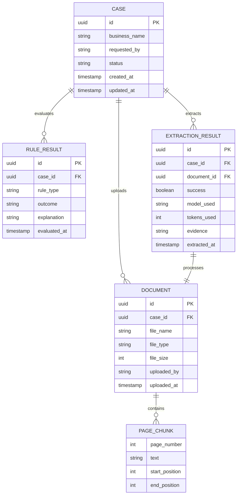

# Data Models

Core data structures and enums used throughout the system.

## CaseEntity

Represents a supplier onboarding investigation.

```java
@Entity
@Table(name = "cases")
public class CaseEntity {
    @Id
    private UUID id;                    // Unique case identifier
    
    private String businessName;        // Supplier business name
    private String requestedBy;         // Analyst email who created case
    
    @Enumerated(EnumType.STRING)
    private CaseStatus status;          // Current workflow status
    
    @Temporal(TIMESTAMP)
    private LocalDateTime createdAt;    // Case creation time
    
    @Temporal(TIMESTAMP)
    private LocalDateTime updatedAt;    // Last update time
    
    @OneToMany(mappedBy = "caseEntity")
    private List<DocumentEntity> documents;        // Uploaded documents
    
    @OneToMany(mappedBy = "caseEntity")
    private List<RuleResult> ruleResults;          // Rule evaluation results
}
```

### CaseStatus Enum

```
INTAKE                    // Case received, awaiting document
    ↓
DOCUMENT_UPLOADED         // PDF uploaded
    ↓
EVIDENCE_EXTRACTED        // LLM extracted facts from PDF
    ↓
ENTITY_VERIFIED           // ABN lookup completed
    ↓
SANCTIONS_SCREENED        // Sanctions check completed
    ↓
RULES_EVALUATED           // All business rules evaluated
    ↓
POLICY_ASSESSED           // Policies reviewed
    ↓
REVIEW_READY              // Package prepared for human review
    ↓
HUMAN_DECISION_PENDING    // Awaiting analyst decision
    ↓
COMPLETED                 // Case closed (approved/rejected)
```

---

## DocumentEntity

Represents an uploaded PDF file.

```java
@Entity
@Table(name = "documents")
public class DocumentEntity {
    @Id
    private UUID id;                    // Unique document ID
    
    @ManyToOne
    @JoinColumn(name = "case_id", nullable = false)
    private CaseEntity caseEntity;      // Parent case
    
    private String fileName;            // Sanitized filename
    private String fileType;            // MIME type (application/pdf)
    private Long fileSize;              // Bytes
    
    private String uploadedBy;          // Analyst email
    
    @Temporal(TIMESTAMP)
    private LocalDateTime uploadedAt;   // Upload timestamp
    
    @OneToMany(mappedBy = "document", cascade = CascadeType.ALL)
    private List<PageChunk> chunks;     // Extracted text chunks
}
```

### PageChunk

Represents a 500-character segment of extracted PDF text.

```java
public class PageChunk {
    private int pageNumber;             // Page number in PDF
    private String text;                // Extracted text (500 chars)
    private int startPosition;          // Position in full text
    private int endPosition;            // Position in full text
    // 50-character overlap with previous chunk
}
```

---

## RuleResult

Represents the outcome of evaluating a single business rule.

```java
@Entity
@Table(name = "rule_results")
public class RuleResult {
    @Id
    private UUID id;                    // Unique result ID
    
    @ManyToOne
    @JoinColumn(name = "case_id", nullable = false)
    private CaseEntity caseEntity;      // Parent case
    
    @Enumerated(EnumType.STRING)
    private RuleType ruleType;          // Which rule was evaluated
    
    @Enumerated(EnumType.STRING)
    private RuleOutcome outcome;        // Result
    
    private String explanation;         // Why this outcome
    
    @Temporal(TIMESTAMP)
    private LocalDateTime evaluatedAt;  // Evaluation time
}
```

### RuleOutcome Enum

6-state model for business rule results:

```
┌─────────────────────────────────────────────────────────┐
│                    RULE OUTCOME STATES                  │
├─────────────────────────────────────────────────────────┤
│                                                          │
│  PASS                ✅  Rule conditions met            │
│  ├─ When: ABN valid, not on sanctions list, etc.       │
│  └─ Implication: Green light for this rule             │
│                                                          │
│  FAIL                ❌  Rule conditions NOT met        │
│  ├─ When: ABN invalid, company on sanctions list       │
│  └─ Implication: Red flag, may require escalation      │
│                                                          │
│  ERROR               🚨  Rule evaluation failed         │
│  ├─ When: ABN API timeout, network error               │
│  └─ Implication: Cannot determine status, retry later  │
│                                                          │
│  NOT_EVALUATED       ⏳  Rule not yet evaluated         │
│  ├─ When: LLM extraction pending, rule deferred        │
│  └─ Implication: Waiting for prerequisite data         │
│                                                          │
│  NOT_APPLICABLE      ⊘  Rule doesn't apply             │
│  ├─ When: Rule only for Australian companies           │
│  └─ Implication: Legitimate exception, not a failure   │
│                                                          │
│  UNAVAILABLE         ⚠️  Rule temporarily unavailable   │
│  ├─ When: Feature flag disabled, dependency down       │
│  └─ Implication: Cannot evaluate now, try later        │
│                                                          │
└─────────────────────────────────────────────────────────┘
```

### RuleType Enum

```
ABN_VALIDATION          // ABN checksum valid (ISO/IEC 7064)
SANCTIONS_CHECK         // Name not on sanctions list
INDUSTRY_RESTRICTION    // Industry not prohibited
FINANCIAL_THRESHOLD     // Revenue above minimum threshold
POLICY_COMPLIANCE       // Meets internal policy requirements
SUPPLIER_MASTER_MATCH   // Found in internal supplier database
DIRECTOR_DUE_DILIGENCE  // Directors pass KYC checks
CONFLICT_OF_INTEREST    // No conflict with existing suppliers
```

---

## ExtractionResult

Represents the output of LLM-based evidence extraction.

```java
@Entity
@Table(name = "extraction_results")
public class ExtractionResult {
    @Id
    private UUID id;                    // Unique result ID
    
    @ManyToOne
    @JoinColumn(name = "case_id", nullable = false)
    private CaseEntity caseEntity;      // Parent case
    
    @ManyToOne
    @JoinColumn(name = "document_id", nullable = false)
    private DocumentEntity document;    // Source document
    
    private Boolean success;            // Extraction succeeded?
    
    private String modelUsed;           // "claude-3-5-sonnet-20241022"
    private Integer tokensUsed;         // Token count from Claude
    
    private String evidence;            // Extracted facts as text
    private String errorMessage;        // If success=false
    
    @Temporal(TIMESTAMP)
    private LocalDateTime extractedAt;  // Extraction timestamp
}
```

### SupplierFact

Represents a single extracted fact about a supplier.

```java
public class SupplierFact {
    private String category;            // "company_name", "founded_year", etc.
    private String value;               // The extracted value
    private Double confidence;          // 0.0-1.0 confidence score
    private List<Integer> pages;        // Pages where found
}
```

---

## Relationship Diagram



---

## Important Properties

### Case Ownership
- Documents can only be accessed/deleted by the case they belong to
- Enforced via composite query: `documentId + caseId`
- Prevents cross-case data leakage

### Document Immutability
- Documents are append-only (no updates after upload)
- File content never changes
- Metadata (fileName, fileSize) immutable

### Rule Result Immutability
- Rule results are never updated after creation
- Historical record of each rule evaluation
- Enables audit trail and rollback if needed

### Timestamp Tracking
- All entities track `createdAt` (immutable)
- All entities track `updatedAt` (updates only)
- Enables temporal queries and change history

---

## Database Schema

Created and managed by Flyway migrations (V1-V5):

| File | Changes |
|------|---------|
| V1__create_cases.sql | Create `cases` table |
| V2__create_documents.sql | Create `documents` table |
| V3__create_rules.sql | Create `rule_results` table |
| V4__create_tools.sql | Create `tool_results` table |
| V5__create_extractions.sql | Create `extraction_results` table |

---

## Next Steps

- **View API responses:** See [API Overview](./getting-started/api-overview.md)
- **Understand rules:** Read [Rules Evaluation](./deep-dives/rules-evaluation.md)
- **See database schema:** Check [Database](./deep-dives/database.md)
