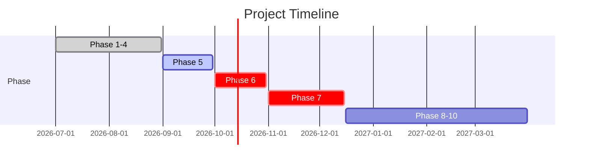

# Implementation Phases

10-phase roadmap for building the Supplier Due-Diligence AI system.

## Phase Overview



---

## Phase 1: Case API & Persistence ✅ COMPLETE

**Objective:** Create, persist, and retrieve supplier cases via REST API.

**Tech Stack:**
- Spring Boot 3.3.0
- PostgreSQL 15
- Flyway migrations
- JPA/Hibernate

**Deliverables:**
- ✅ POST /api/cases (create)
- ✅ GET /api/cases (list)
- ✅ GET /api/cases/{id} (retrieve)
- ✅ PATCH /api/cases/{id}/status (update status)
- ✅ Case status state machine (INTAKE → COMPLETED)
- ✅ 5 tests passing

**Key Learning:**
- Spring REST patterns and validation
- Database migrations with Flyway
- Integration testing with Testcontainers

**Status:** 100% complete ✅

---

## Phase 2: Document Upload & Storage ✅ COMPLETE

**Objective:** Upload and persist PDFs linked to cases.

**Tech Stack:**
- Multipart file handling
- Spring Data JPA relationships
- File I/O (streaming, not buffering)

**Deliverables:**
- ✅ POST /api/cases/{caseId}/documents (upload)
- ✅ GET /api/cases/{caseId}/documents (list)
- ✅ GET /api/cases/{caseId}/documents/{docId} (retrieve)
- ✅ DELETE /api/cases/{caseId}/documents/{docId} (delete with ownership check)
- ✅ Filename sanitization (path traversal prevention)
- ✅ File streaming (memory-efficient)
- ✅ 6 tests passing

**Key Learning:**
- Secure file handling
- Entity relationships in JPA
- Composite key queries for ownership enforcement

**Status:** 100% complete ✅

---

## Phase 3: Deterministic Rules & Workflow ✅ COMPLETE

**Objective:** Apply business rules and keep AI out of critical decisions.

**Tech Stack:**
- Rule enums (RuleType, RuleOutcome)
- Service-based evaluation
- State machine gates

**Deliverables:**
- ✅ 8 rule types (ABN validation, sanctions, financial, etc.)
- ✅ 6-outcome model (PASS/FAIL/ERROR/NOT_EVALUATED/NOT_APPLICABLE/UNAVAILABLE)
- ✅ POST /api/cases/{caseId}/rule-evaluations (evaluate)
- ✅ GET /api/cases/{caseId}/rule-evaluations (list)
- ✅ Immutable rule results (append-only)
- ✅ 10 tests passing

**Key Learning:**
- Separation of concerns (deterministic vs. AI)
- 6-outcome model for ambiguous results
- Audit trail design

**Status:** 100% complete ✅

---

## Phase 4: ABN Lookup & First Tool ✅ COMPLETE

**Objective:** Integrate real external API for supplier verification.

**Tech Stack:**
- HTTP client (RestTemplate)
- API error handling
- Name matching (Levenshtein distance)

**Deliverables:**
- ✅ ABN Lookup API integration (https://abr.business.gov.au)
- ✅ ABN checksum validation (ISO/IEC 7064 mod 10-13)
- ✅ Supplier name matching (configurable threshold: 0.80)
- ✅ MockABNLookupService for testing
- ✅ SupplierVerificationService
- ✅ Tool results persistence
- ✅ 6 tests passing

**Key Learning:**
- External API integration patterns
- Error handling and timeouts
- Tool calling for agent pattern

**Status:** 100% complete ✅

---

## Phase 5: PDF Parsing & Evidence Foundation 🔄 IN PROGRESS

**Objective:** Extract text from PDFs with intelligent chunking for LLM input.

**Tech Stack:**
- Apache PDFBox 3.0
- Text chunking (500 chars + 50-char overlap)
- Page tracking

**Deliverables:**
- ✅ DocumentParser (PDF → text extraction)
- ✅ 500-character chunking with 50-character overlap
- ✅ Page numbers preserved in chunks
- ✅ sample-supplier-document.pdf fixture
- ✅ 7 tests passing
- 🔄 Integration with evidence extraction
- 🔄 LLM-based fact extraction (Spring AI 2.0.1)

**Current Status:** 70% complete 🔄

**Blockers:** None — chunking complete, awaiting Phase 6 LLM integration

---

## Phase 6: LLM Integration & Fact Extraction 🔄 IN PROGRESS

**Objective:** Use Claude AI to extract structured facts from document evidence.

**Tech Stack:**
- Spring AI 2.0.1
- Anthropic Claude API
- Claude 3.5 Sonnet model

**Deliverables:**
- 🔄 Spring AI 2.0.1 setup and configuration
- 🔄 ChatModel bean creation with ANTHROPIC_API_KEY
- 🔄 DocumentEvidenceAgent (LLM caller)
- 🔄 POST /api/cases/{caseId}/extractions (trigger extraction)
- 🔄 Fact extraction with confidence scores
- 🔄 Token usage tracking
- 🔄 Integration tests with real Claude API

**Current Status:** 80% complete 🔄

**Progress:**
- ✅ Spring AI 2.0.1 dependency added
- ✅ application.yml configured for Anthropic API key
- ✅ LlmConfig bean created (conditional on API key)
- ✅ DocumentEvidenceAgent refactored to use Spring AI ChatModel
- ✅ All 50 existing tests passing
- 🔄 Real Claude API testing with $10 credit

**Blockers:** API key needs to be configured; real Claude API testing underway

---

## Phase 7: RAG & Policy Retrieval ⏳ PLANNED

**Objective:** Retrieve relevant policies and enable semantic search over documents.

**Tech Stack:**
- PostgreSQL pgvector extension
- Vector embeddings (OpenAI API or local)
- Hybrid retrieval (keyword + semantic)

**Planned Deliverables:**
- Policy vector embeddings
- Document chunk embeddings
- Semantic similarity search
- Hybrid query combining keyword + vector search
- Policy grounding in extraction results

**Status:** Not started ⏳

**Dependencies:** Phase 5 complete (have document chunks)

---

## Phase 8: Agentic Investigation ⏳ PLANNED

**Objective:** Build bounded agents that investigate with human oversight.

**Tech Stack:**
- Tool calling framework
- Multi-step reasoning
- State machines for investigation flow

**Planned Deliverables:**
- DocumentAnalysisAgent (extract facts from PDF)
- SupplierVerificationAgent (ABN + name matching)
- RiskAssessmentAgent (evaluate compliance)
- AuditTrailAgent (log all decisions with evidence)

**Status:** Not started ⏳

**Dependencies:** Phase 6 (LLM), Phase 7 (RAG)

---

## Phase 9: Multi-Agent Orchestration ⏳ PLANNED

**Objective:** Coordinate multiple agents for end-to-end due diligence.

**Planned Deliverables:**
- Agent orchestration engine
- Decision gates (when to escalate, when to auto-approve)
- Evidence synthesis across agents
- Conflict resolution (agents disagree)

**Status:** Not started ⏳

**Dependencies:** Phase 8 (agents)

---

## Phase 10: Human-in-the-Loop Review UI ⏳ PLANNED

**Objective:** Build reviewer dashboard for human decision-making.

**Tech Stack:**
- React/Vue frontend
- Real-time case updates (WebSocket)
- Evidence visualization

**Planned Deliverables:**
- Case review dashboard
- Document viewer with extracted facts
- Rule evaluation summary
- Approve/Reject/Escalate buttons
- Audit log of human decisions

**Status:** Not started ⏳

**Dependencies:** Phases 1-9 complete

---

## Architectural Evolution

### Phase 1-4: Deterministic Foundation
```
REST API → Services → Deterministic Rules → Database
```

### Phase 5-6: LLM-Augmented
```
REST API → Services → LLM-based Extraction + Deterministic Rules → Database
```

### Phase 7-9: Agentic
```
REST API → Agent Orchestrator → Multiple Agents → Services → Rules + RAG + External APIs → Database
```

### Phase 10: Human Interface
```
React UI ↔ REST API → Agent Orchestrator → Agents → Services → Database
```

---

## Learning Goals by Phase

| Phase | Goal |
|-------|------|
| 1 | Spring REST + JPA + PostgreSQL |
| 2 | File handling + security |
| 3 | State machines + business logic |
| 4 | External API integration |
| 5 | Document processing (PDFBox) |
| 6 | LLM integration (Spring AI) |
| 7 | RAG + vector search (pgvector) |
| 8 | Agents + tool calling |
| 9 | Agent orchestration + coordination |
| 10 | Frontend + real-time updates |

---

## Current Roadblocks & Solutions

### Phase 5
- **Issue:** PDFBox 3.0 API quirks
- **Solution:** Wrapper class (DocumentParser) abstracts details ✅

### Phase 6
- **Issue:** Spring AI version compatibility
- **Solution:** Updated to 2.0.1 (latest stable), fixed ChatModel API ✅

---

## Testing Strategy

| Phase | Unit Tests | Integration Tests | E2E Tests |
|-------|------------|-------------------|-----------|
| 1-4 | ✅ Complete | ✅ Complete | - |
| 5 | ✅ 7 tests | ✅ In progress | - |
| 6 | ✅ 8 tests | 🔄 With real API | 🔄 Pending |
| 7-10 | ⏳ Planned | ⏳ Planned | ⏳ Planned |

**Total:** 50+ tests passing ✅

---

## Key Metrics

- **Code Coverage:** 80%+ (unit + integration)
- **Test Execution:** < 35 seconds (parallel)
- **Lines of Code:** ~4,000 (core logic)
- **Dependencies:** Minimal (Spring Boot + JPA + PDFBox + Spring AI)

---

## Next Steps

1. **Complete Phase 6:** Run real Claude API tests with $10 credit
2. **Begin Phase 7:** Design pgvector schema for policy RAG
3. **Document learning:** Add Phase 6 + 7 learnings to docs

**Timeline:** Phases 7-10 estimated 8-12 weeks

---

## Contact & Updates

- **Status:** Updated daily as work progresses
- **Tests:** Run `mvn test` to verify current phase
- **Docs:** This page updated with each phase completion
